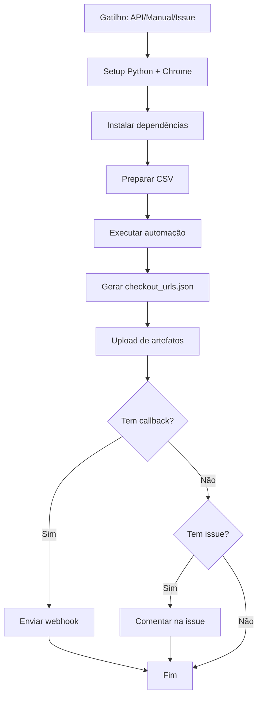

# 🏃‍♂️ Sprinta Scraper

Automação de inscrições de atletas na plataforma Sprinta usando Selenium WebDriver com integração Wix via Webhook.

## 🚀 Funcionalidades

- ✅ Login automático na plataforma Sprinta
- ✅ Inscrição de múltiplos participantes via CSV
- ✅ Preenchimento automático de formulários
- ✅ Geração de URLs de checkout para pagamento
- ✅ Aplicação automática de cupom de desconto
- ✅ Sessão persistente (evita múltiplos logins)
- ✅ Modo debug e modo rápido
- ✅ GitHub Actions com disparo automático (push)
- ✅ **Webhook Wix integrado** para notificação em tempo real
- ✅ Backup automático de resultados (30 dias)

## 🔔 Nova Arquitetura com Webhook

O sistema agora usa **webhooks** para comunicação direta entre GitHub Actions e Wix:

```
CSV salvo → GitHub Actions → Automação → Webhook Wix → Redirecionamento
```

**Payload do Webhook:**
```json
{
  "submissionId": "inscricao_123",
  "success": true,
  "redirectUrl": "https://eventos.sprinta.com.br/checkout/xyz123"
}
```

📖 **[Ver documentação completa da nova arquitetura →](NOVA_ARQUITETURA_WEBHOOK.md)**

## 📋 Pré-requisitos

### Execução Local

- Python 3.12+
- Google Chrome
- ChromeDriver

### GitHub Actions (Automático)

Nenhum requisito local - tudo roda na nuvem do GitHub!

## 🔧 Instalação Local

```bash
# Clone o repositório
git clone https://github.com/SEU_USUARIO/Sprinta-Scraper.git
cd Sprinta-Scraper

# Instale as dependências
pip install -r requirements.txt

# Configure as credenciais (crie um arquivo .env ou edite o código)
export SPRINTA_EMAIL="seu-email@empresa.com"
export SPRINTA_PASSWORD="sua-senha"
```

## 📝 Formato do CSV

Crie um arquivo `participants.csv` com as seguintes colunas:

```csv
name;email;phone;cpf;bday;gender;shirt_size;team
João Silva;joao@example.com;51999990000;02443423000;01/01/1985;m;G;Equipe Alpha
Maria Santos;maria@example.com;51999990001;12345678900;15/02/1990;f;M;Equipe Beta
```

**Colunas:**
- `name`: Nome completo
- `email`: E-mail do participante
- `phone`: Telefone (apenas números)
- `cpf`: CPF (11 dígitos, com ou sem zeros à esquerda)
- `bday`: Data de nascimento (DD/MM/AAAA)
- `gender`: Gênero (m/f/male/female/masculino/feminino)
- `shirt_size`: Tamanho da camiseta (PP/P/M/G/GG/XG/X1/X2/X3)
- `team`: Nome da equipe

## 🎯 Uso Local

### Com argumentos CLI (novo)

```bash
# Básico
python sprinta_automation.py inscricoes/participantes.csv

# Com webhook do Wix
python sprinta_automation.py inscricoes/participantes.csv \
  --webhook-url "https://manage.wix.com/_api/webhook-trigger/report/..." \
  --submission-id "inscricao_123"

# Modo debug (visualizar navegador)
python sprinta_automation.py inscricoes/participantes.csv --debug

# Personalizar saída
python sprinta_automation.py inscricoes/participantes.csv --output resultados.csv
```

### Modo programático (legado)

```python
from sprinta_automation import process_csv

process_csv(
    "participants.csv",
    "checkout_urls.csv",
    debug_mode=True,
    use_persistent_session=True
)
```

## ☁️ Uso via GitHub Actions (RECOMENDADO)

### ⚡ Opção 1: Automático (Push CSV)

**Método mais simples e recomendado!**

1. Salve seu CSV na pasta `inscricoes/`:
```bash
# Nome sugerido: inscricao_TIMESTAMP.csv
cp participantes.csv inscricoes/inscricao_$(date +%s).csv
```

2. Commit e push:
```bash
git add inscricoes/inscricao_*.csv
git commit -m "feat: adicionar nova inscrição"
git push origin main
```

3. **Pronto!** O GitHub Actions dispara automaticamente e:
   - ✅ Processa a inscrição
   - ✅ Gera checkout URL
   - ✅ Envia webhook para o Wix
   - ✅ Cliente é redirecionado automaticamente

### 📋 Opção 2: Acionamento Manual

1. Vá até a aba **Actions** do seu repositório
2. Selecione o workflow **"Processar Inscrições Sprinta (Auto-trigger)"**
3. Clique em **"Run workflow"**
4. Digite o nome do arquivo CSV (exemplo: `inscricao_123.csv`)
5. Aguarde o processamento
6. Veja o resultado em **Artifacts**

### Opção 2: Via API Externa (Repository Dispatch)

Use esta opção para integrar com seu sistema externo:

```bash
curl -X POST \
  -H "Accept: application/vnd.github+json" \
  -H "Authorization: Bearer SEU_GITHUB_TOKEN" \
  -H "X-GitHub-Api-Version: 2022-11-28" \
  https://api.github.com/repos/SEU_USUARIO/Sprinta-Scraper/dispatches \
  -d '{
    "event_type": "process-inscricoes",
    "client_payload": {
      "csv_content": "name;email;phone;cpf;bday;gender;shirt_size;team\nJoão Silva;joao@example.com;51999990000;02443423000;01/01/1985;m;G;Equipe Alpha",
      "callback_url": "https://seu-sistema.com/webhook/sprinta-results"
    }
  }'
```

**Parâmetros:**
- `csv_content`: Conteúdo do CSV em texto
- `csv_base64`: Alternativa - CSV em base64 (para arquivos grandes)
- `callback_url`: (Opcional) URL para receber o resultado via POST
- `issue_number`: (Opcional) Número da issue para comentar resultado

### Opção 3: Via Issue (GitHub Issue)

1. Crie uma issue no repositório
2. Anexe o arquivo CSV
3. Use a API para acionar:

```bash
curl -X POST \
  -H "Accept: application/vnd.github+json" \
  -H "Authorization: Bearer SEU_GITHUB_TOKEN" \
  https://api.github.com/repos/SEU_USUARIO/Sprinta-Scraper/dispatches \
  -d '{
    "event_type": "process-inscricoes",
    "client_payload": {
      "issue_number": 123,
      "csv_content": "..."
    }
  }'
```

O resultado será comentado automaticamente na issue!

## 🔐 Configuração de Secrets

Para usar GitHub Actions, configure os seguintes secrets no repositório:

1. Vá em **Settings** → **Secrets and variables** → **Actions**
2. Adicione os secrets:

| Secret | Descrição | Obrigatório |
|--------|-----------|-------------|
| `SPRINTA_EMAIL` | Email de login no Sprinta | ✅ Sim |
| `SPRINTA_PASSWORD` | Senha do Sprinta | ✅ Sim |
| `WIX_WEBHOOK_URL` | URL do webhook Wix | ⚠️ Recomendado |

### Webhook Wix URL

```
https://manage.wix.com/_api/webhook-trigger/report/4e65b86c-5428-4b90-aa76-564e5185bb93/e19eb522-0ffd-4c88-bab0-f06837221b5f
```

**Formato do payload enviado:**
```json
{
  "submissionId": "inscricao_123",
  "success": true,
  "redirectUrl": "https://eventos.sprinta.com.br/checkout/xyz123"
}
```

## 📊 Resultado

O script gera um arquivo `checkout_urls.csv` com as URLs de pagamento:

```csv
email,checkout_url
joao@example.com,https://checkout.sprinta.com.br/v27310473ilMArua8LX52o6V
maria@example.com,https://checkout.sprinta.com.br/v27310474abCDefgh12345678
```

No GitHub Actions, também gera `checkout_urls.json`:

```json
[
  {
    "email": "joao@example.com",
    "checkout_url": "https://checkout.sprinta.com.br/v27310473ilMArua8LX52o6V"
  }
]
```

## ⚡ Performance

| Modo | Tempo/participante | 10 participantes | 50 participantes | 100 participantes |
|------|-------------------|------------------|------------------|-------------------|
| Debug | ~30s | 5min | 25min | 50min |
| **Rápido** | **~8s** | **1.3min** | **6.5min** | **13min** |

**Ganho: 73% mais rápido no modo rápido!** ⚡

## 📚 Documentação Adicional

- [SESSAO_PERSISTENTE.md](SESSAO_PERSISTENTE.md) - Como funciona a sessão persistente
- [OTIMIZACAO_VELOCIDADE.md](OTIMIZACAO_VELOCIDADE.md) - Guia de otimização de velocidade
- [ANALISE_TEMPO.md](ANALISE_TEMPO.md) - Análise detalhada de tempos
- [DEBUG_README.md](DEBUG_README.md) - Guia de debugging

## 🛠️ Arquitetura

```
sprinta_automation.py
├── create_driver()          # Cria instância do Chrome (com/sem sessão persistente)
├── check_if_logged_in()     # Verifica se já está logado
├── login()                  # Faz login no Sprinta
├── register_participant()   # Registra um participante
│   ├── Clica "Enroll a friend" (2x)
│   ├── Preenche dados pessoais
│   ├── Seleciona categoria e kit
│   ├── Preenche tamanho e equipe
│   └── Captura URL de checkout
└── process_csv()            # Processa todos os participantes do CSV
```

## 🔄 Workflow do GitHub Actions



## 🐛 Troubleshooting

### Erro de login

Verifique se as credenciais estão corretas:

```bash
echo $SPRINTA_EMAIL
echo $SPRINTA_PASSWORD
```

### Chrome não encontrado

```bash
# macOS
brew install --cask google-chrome

# Ubuntu
wget https://dl.google.com/linux/direct/google-chrome-stable_current_amd64.deb
sudo dpkg -i google-chrome-stable_current_amd64.deb
```

### CSV não reconhecido

Certifique-se de usar ponto-e-vírgula (`;`) como delimitador.

## 📄 Licença

MIT License - veja [LICENSE](LICENSE) para detalhes.

## 🤝 Contribuindo

Pull requests são bem-vindos! Para mudanças grandes, abra uma issue primeiro.

## 👤 Autor

Criado por [Seu Nome]

## 🙏 Agradecimentos

- Selenium WebDriver
- GitHub Actions
- Sprinta Platform
