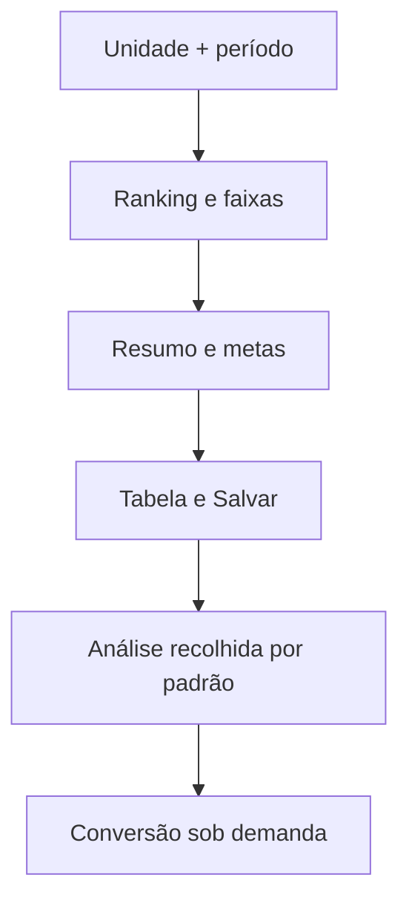

# Experiência do módulo Atendimento

**Estado documentado:** implementação consolidada em 2026-07-18. A interface consome contratos do backend; não é fonte de regras financeiras, autorização ou persistência.

## Objetivo operacional

O operador precisa registrar produção com segurança e localizar o que já foi lançado. A gerência precisa comparar profissionais, metas e distribuição sem transformar a tela inicial em um relatório técnico. A ordem de leitura é:

1. unidade e período ativos;
2. ranking e faixas do período;
3. resumo financeiro/operacional;
4. tabela e criação explícita de registros;
5. análise de conversão somente quando solicitada.

## Organização e divulgação progressiva

- O ranking mostra realizado, posição e faixa. Faixas/linhas são legíveis no gráfico e recebem detalhes por hover, sem repetir texto longo em badges.
- O resumo reúne total, meta diária, média por registro, mediana, desvio padrão, limites, linha de corte e intervalo. Cada métrica mostra o valor e, abaixo, a aplicação no recorte atual; o tooltip traz fórmula genérica, origem, unidade/período e limitações.
- O painel **Multiplicador por homogeneidade** fica diretamente no dashboard: curva, platô, valor escolhido, razões compactas, base de cálculo, evolução e alertas. Não existe modal para informação necessária à explicação do `k`.
- A análise começa recolhida e seu relatório de conversão só é buscado quando o usuário a abre. O resultado é cacheado pelo recorte e invalidado por escrita ou importação relacionada.
- "Todas unidades" deixa explícito que capacidade e metas são somadas por unidade-mês; não oferece um calendário consolidado inexistente.

## Tooltips e popovers

O padrão é um único cartão acessível de contexto: título, valor quando houver, significado, fórmula genérica, cálculo do recorte, filtros/fontes e alerta de limitação. Ele fecha em `Escape`, pode receber foco e nunca é o único lugar de um alerta crítico.

| Alvo | Gatilho permitido | Conteúdo | Não deve capturar |
| --- | --- | --- | --- |
| Métrica | ícone de informação ou valor | fórmula, cálculo atual e fonte | edição e ações essenciais |
| Faixa/linha do gráfico | ícone/linha da própria faixa | limite, significado e período | barra, avatar e nome do médico |
| Profissional | somente barra, foto ou nome | realizado, nível, posição e contexto | área vazia do gráfico e faixas |
| Curva/platô `k` | ponto, região selecionada ou valor | platô, `k` anterior, motivo e homogeneidade | controles de período |

Os elementos usam o mesmo vocabulário visual em gráfico e resumo: ícones de limite superior, linha de corte, limite inferior, intervalo e distribuição não são recriados com significados paralelos. Cor reforça o estado, mas texto, ícone e posição também o comunicam.

## Tabela e lançamento

- Não há autosave. Uma linha rascunho só vira registro após **Salvar**.
- Cliente tem autocomplete por unidade: normaliza a busca, usa cadastro e histórico permitido, permite escolher a correspondência e evita criar um cliente duplicado apenas por variação de escrita.
- Profissional é escolhido por identidade canônica existente. O frontend mostra a mensagem do backend para alias, inatividade, papel errado ou vínculo de unidade inválido; ele nunca cria/mescla profissional sozinho.
- Edição e exclusão apresentam erro de validação, 409 de revisão concorrente ou 428 de revisão ausente de forma acionável, preservando o rascunho quando possível.
- Colunas usam larguras pelo conteúdo e encolhem em desktop. Em telas estreitas há uma única região de rolagem horizontal com cabeçalho, foco e leitura por teclado preservados; ocultar campos necessários não é uma estratégia de responsividade.

## Período, metas e estados

Semana e mês usam ícones distinguíveis. O indicador ao lado do ícone ativo expande no mesmo grupo e resume os dias operacionais como `Nd laborais`. Atalhos de 7 e 30 dias pertencem ao seletor de período personalizado, não duplicam controles visíveis. Meta do período fica no contexto da meta diária, que explica a divisão pelos dias operacionais do recorte.

| Estado | Resposta visual |
| --- | --- |
| Carregamento | skeleton/indicador sem trocar o recorte atual por zeros. |
| Erro | mensagem curta e ação de tentar novamente; detalhes internos não aparecem. |
| Sem registros | zero operacional explícito e ação para criar o primeiro lançamento. |
| Meta ausente | valor zero identificado como meta ausente, não como atingimento zero. |
| Poucos profissionais/sem variância | alerta estatístico visível; curva/platô não finge precisão. |
| Escopo restrito | unidade indisponível é removida/recusada e a mensagem explica a restrição. |
| Conflito 409 | informa que outro operador alterou o registro e orienta recarregar. |

## Acessibilidade, desempenho e contratos E2E

- Botões, ícones interativos, comboboxes, tabela e popovers possuem nome acessível, foco perceptível e operação por teclado.
- `data-testid` e contratos E2E são preservados nas extrações de componentes.
- A análise não faz requisição enquanto recolhida; mudanças de filtro cancelam ou invalidam respostas obsoletas e não duplicam consulta.
- Gráficos priorizam elementos SVG focáveis quando interativos, alternativa textual e não dependem de hover para entendimento mínimo.
- O viewport de referência inclui `390 × 844`; ranking, resumo, formulário e rolagem de tabela precisam manter operação funcional nesse tamanho.

As fórmulas, semântica de níveis e comportamentos de borda estão em [atendimento-core-rules.md](atendimento-core-rules.md). O fluxo de execução e validação local está em [atendimento-local-validation.md](../runbooks/atendimento-local-validation.md).
