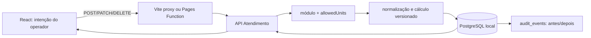

# Auditoria técnica — Atendimento

**Consolidação:** 2026-07-18
**Escopo:** `crm/console`, `crm/api/server/atendimento`, proxy Pages, PostgreSQL local, migrations e launchers locais.
**Ambiente:** somente local autorizado. Nenhuma produção foi acessada, migrada ou sincronizada.

## Diagnóstico final

O módulo separa corretamente **produção de procedimentos** de venda e recebimento. `crm_atendimento.attendances` é a fonte dos realizados; Caixa segue como uma futura fonte distinta de recebimentos. O backend Express/PostgreSQL calcula, autoriza, persiste e audita. React apenas coleta a intenção, apresenta as respostas e pode mostrar uma prévia não confiável.

| Área | Estado consolidado | Evidência principal |
| --- | --- | --- |
| Escrita financeira | Servidor recalcula `value`; o valor vindo do navegador só entra no evento de auditoria como valor ignorado. | `domain.js`, `store.js`, testes de domínio/store/rotas |
| Fórmula e histórico | Novos registros usam `attendance-value/v1`; legado é marcado como `attendance-value/legacy-imported-v0` sem recálculo. | migration `20260718_atendimento_write_safety_v1` |
| Autorização | Leitura e mutação aplicam módulo e `allowedUnits`; escopo explícito vazio falha fechado. Update/delete verificam a unidade do registro e a unidade de destino. | `routes.js`, `store.js` |
| Concorrência | `revision` é obrigatória em PATCH/DELETE; ausência retorna 428 e revisão antiga retorna 409. | contrato de mutação e testes de rota |
| Idempotência | `Idempotency-Key` é única por identidade estável do autor, não por papel; replay devolve a criação original. | índice parcial e `actorIdentityForMutation` |
| Auditoria | Criação, edição, exclusão, importação e mudança gerencial registram antes/depois, autor e contexto da fórmula. | `audit_events` |
| Conversão | `GET /management/conversion-report` filtra o escopo do ator e não escreve agenda, configuração ou resultados. | rota/store e testes read-only |
| Profissionais | Há identidade canônica, aliases confirmados, vínculo por unidade/papel e diagnóstico read-only de duplicidades. Não há mesclagem automática. | `professionalIdentity.js` e migration própria |
| Todas unidades | Totais, metas e capacidade são somados antes dos cálculos. Não há média de métricas por unidade nem calendário fictício. | `store.js`/`domain.js` |
| Interface | Análise recolhida por padrão, carregamento sob demanda, bloco direto de homogeneidade e tooltips sem disputa de hover. | `AtendimentoModule.tsx`, componentes extraídos e E2E |
| Local | Launcher do Atendimento sobe API local nova, aplica migration segura, escolhe portas livres e abre o navegador Windows. | `run-local-atendimento.sh` |

## Fluxo consolidado

## Achados resolvidos

1. **P0 — valor sob controle do cliente:** removida a confiança em `value` do navegador; toda escrita normaliza campos e calcula o valor no backend.
2. **P0 — escape entre unidades/IDOR:** mutações verificam o escopo do ator contra a unidade atual e a futura; leituras, clientes, referências e conversão também respeitam o escopo.
3. **P0 — replay/condição de corrida:** chave de idempotência por autor e `revision` com comparação no `UPDATE`/`DELETE` evitam duplicação e escrita perdida.
4. **P1 — histórico não explicável:** fórmula versionada, evento antes/depois, ator, chave de idempotência e valor de cliente ignorado passam a ser rastreáveis.
5. **P1 — GET com efeito colateral:** relatório de conversão é somente leitura; persistência continua em operações gerenciais explícitas e autorizadas.
6. **P1 — identidade textual de profissionais:** aliases confirmados ligam-se a uma identidade canônica, mantendo texto histórico e impedindo criação silenciosa de profissionais por lançamento manual.
7. **P1 — agregação estatística incorreta:** "Todas unidades" virou uma nova apuração por conjunto de linhas, unidade-mês e profissional canônico.
8. **P2 — UX excessiva e pouco explicável:** detalhes foram concentrados no painel direto do multiplicador; análise e conversão ficaram sob demanda, enquanto fórmulas e valores do recorte permanecem acessíveis.
9. **P2 — launcher imprevisível:** scripts verificam pertencimento do processo antes de encerrar, alocam portas automaticamente e usam `Start-Process` no Windows em vez de Chromium Linux.

## Riscos e pendências aceitos

- **Remuneração:** `attendance-remuneration/legacy-preview-v1` é uma prévia, não uma política de folha. Beneficiário, impostos, teto, estornos, vigência e aprovação empresarial ainda não foram formalizados.
- **Linha de corte:** os pesos 30% média, 20% mediana e 50% meta diária estão versionados/rastreáveis, mas a justificativa empresarial deve ser aprovada antes de permitir configuração por usuários.
- **Identidade:** nomes semelhantes continuam distintos até confirmação humana. O relatório de duplicidades é uma proposta, não autorização de mesclagem.
- **Dados legados:** linhas históricas inválidas ou incompletas são preservadas e marcadas; não há saneamento ou recálculo silencioso.
- **Calendário agregado:** como unidades podem ter calendários diferentes, a tela exibe capacidade somada e `calendarCompatible=false`, não uma agenda consolidada.
- **Ambiente local:** o launcher isolado requer `DATABASE_URL` local para `skincos_crm_local`. Sem essa variável, a falha é esperada e segura.

## Achados preservados da auditoria de origem, fora deste escopo

Os controles abaixo não foram alterados pela consolidação de Atendimento. Eles
continuam relevantes e foram preservados aqui para que a documentação de
origem não seja perdida durante a aposentadoria da worktree de auditoria.

| Tema | Risco observado | Próximo passo seguro |
| --- | --- | --- |
| Metas importadas e manuais | A meta manual e a meta importada ainda podem disputar a mesma linha efetiva, permitindo que uma importação posterior substitua uma decisão operacional. | Modelar `goal_overrides` separado, com vigência, motivo, aprovador e precedência explícita; manter o valor importado imutável. |
| Reconciliação de importação | A importação identifica linhas por `(source_sheet_id, source_tab, source_row)`, mas a remoção da linha na fonte ainda não produz baixa/revisão explícita no Atendimento. | Introduzir lote com `seen_in_batch`, prévia/diff e aprovação antes de inativar ou reconciliar ausências. |
| Retenção e classificação | Snapshots de planilhas podem replicar PII, fórmulas e dados financeiros sem política de classificação/retenção definida. | Classificar colunas, reduzir persistência, definir retenção/purga auditável e bloquear fallback público para fontes sensíveis. |
| Produção, venda e recebimento | Atendimento mede produção; Caixa ainda não é um razão de recebimentos conciliado. | Criar domínio de recebimentos, estorno e conciliação antes de apresentar produção como receita recebida. |

Esses itens são pendências de produto e governança de dados, não autorização
para recalcular histórico, remover registros importados ou alterar metas sem
aprovação explícita.

## Prioridade de evolução

| Prioridade | Próxima ação | Critério de aceite |
| --- | --- | --- |
| P0 | Formalizar política de remuneração e pesos de corte. | Documento de negócio versionado e testes de política nova. |
| P1 | Rever propostas de alias/mesclagem com gestor de dados. | Apenas vínculos aprovados são migrados e auditados. |
| P1 | Executar a matriz local completa com base de fixture controlada. | Evidências sanitizadas para perfil gestor e restrito. |
| P2 | Medir consultas e retenção de auditoria com volume real. | Plano de índice/retensão baseado em `EXPLAIN ANALYZE`. |
| P2 | Separar Caixa de Atendimento quando houver recebimentos confiáveis. | Novo contrato sem redefinir produção como venda. |

Consulte [regras do núcleo](../architecture/atendimento-core-rules.md), [experiência](../architecture/atendimento-experience.md) e o [runbook local](../runbooks/atendimento-local-validation.md) para o contrato operacional vigente.
