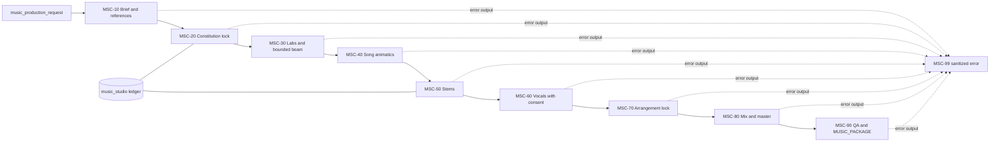

# Architecture

The Music Constitution is immutable by revision/hash. Candidate selection uses
hard filters, preliminary scores, top-k and bounded beam search instead of the
full Cartesian product. Animatics are approved before expensive stem work.

n8n is the control plane: states, IDs, jobs, dependency references, callbacks,
costs, QA and manifests. `audio-service.js` is the external-to-n8n dry-run audio
layer and writes short deterministic PCM WAV fixtures. Logical duration remains
in metadata while CI-sized physical samples prove RIFF integrity. A production
audio service may replace this adapter without moving binary audio through
n8n.

The builder is authoritative. It emits one inactive inline workflow and a
one-item import package. Archive descriptors live under
`orb/engine/archived-workflows/music-composition-studio`, outside
`generated-workflows/music-composition-studio`.
