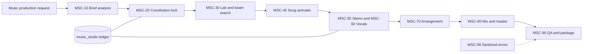

# Architecture

The Music Constitution is immutable by hash/revision. The lab uses constrained
top-k/beam selection rather than Cartesian expansion. n8n owns identifiers,
state and URLs only; `audio-service.js` makes deterministic test WAVs. A future
approved production adapter may use FFmpeg/FFprobe or a service outside n8n.

The builder now emits one unified inactive workflow with the ten functional
MSC stages inline plus native MSC-00 orchestration/package handling. The eleven
former MSC-00…MSC-99 exports remain as explicitly archived snapshots under
`generated-workflows/music-composition-studio/archive`; no
`n8n-nodes-base.executeWorkflow` subworkflow node remains.
