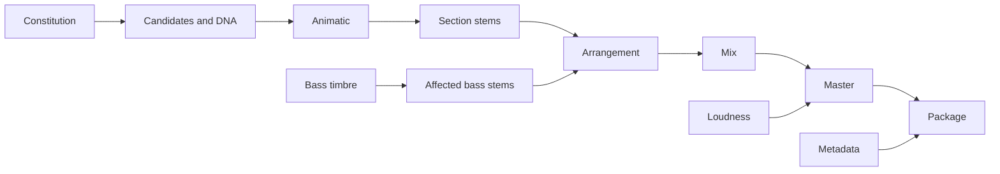

# Selective reprocessing

| Change | Invalidated | Preserved |
| --- | --- | --- |
| Metadata/CTA | package | audio, stems, mix, master |
| Bass timbre | bass, affected sections, arrangement, mix, master, package | melody and unrelated stems |
| Chorus | related harmony/melody/lyrics/stems, arrangement, mix, master | unaffected section stems |
| Loudness | master, package | composition, stems, arrangement, mix |
| Constitution | candidates through package | prior revision and lineage |

`lib/invalidation.js` is the dependency policy. Call
`selectiveReprocess(change, constitution)` with a supported change key. The
result lists invalidated components. A Constitution change increments revision;
the caller must rebuild and persist a new lock hash before downstream work.
Never mutate a locked Constitution in place.

Resume a failed provider job with the same normalized inputs and input hash.
The ledger reuses an approved/completed result and deduplicates callback and
artifact IDs. A changed dependency produces a new hash/revision and only the
listed descendants are scheduled.
