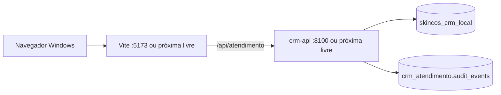
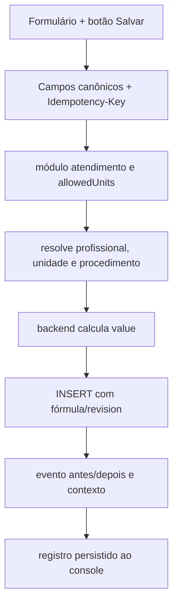
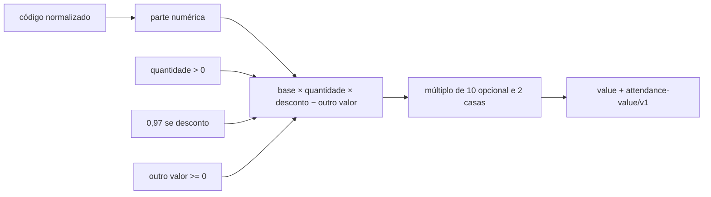
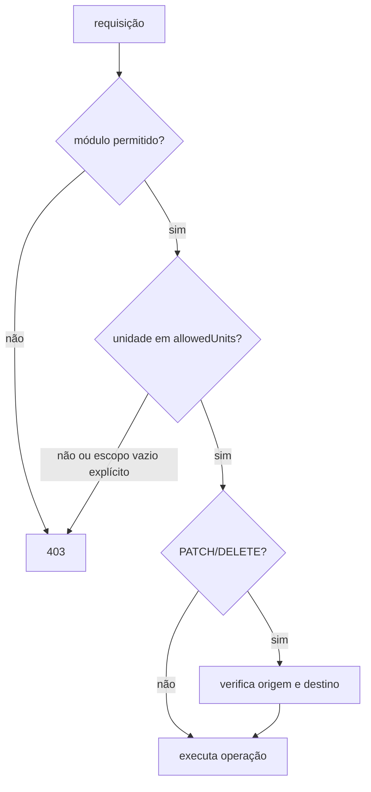
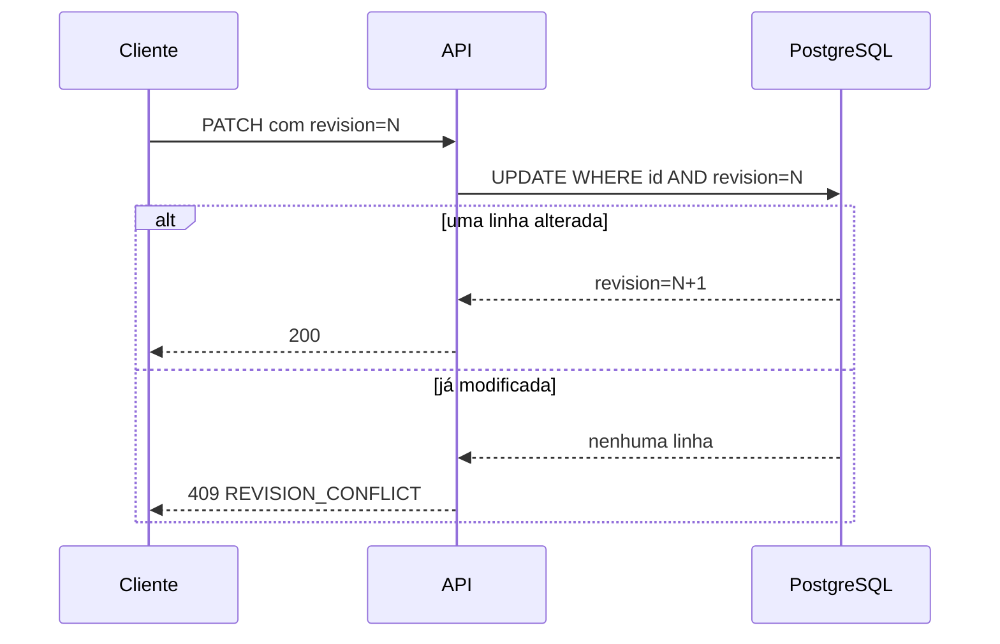
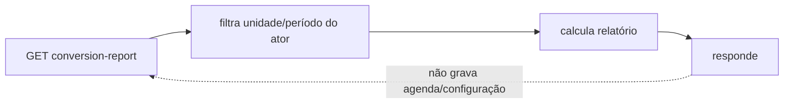
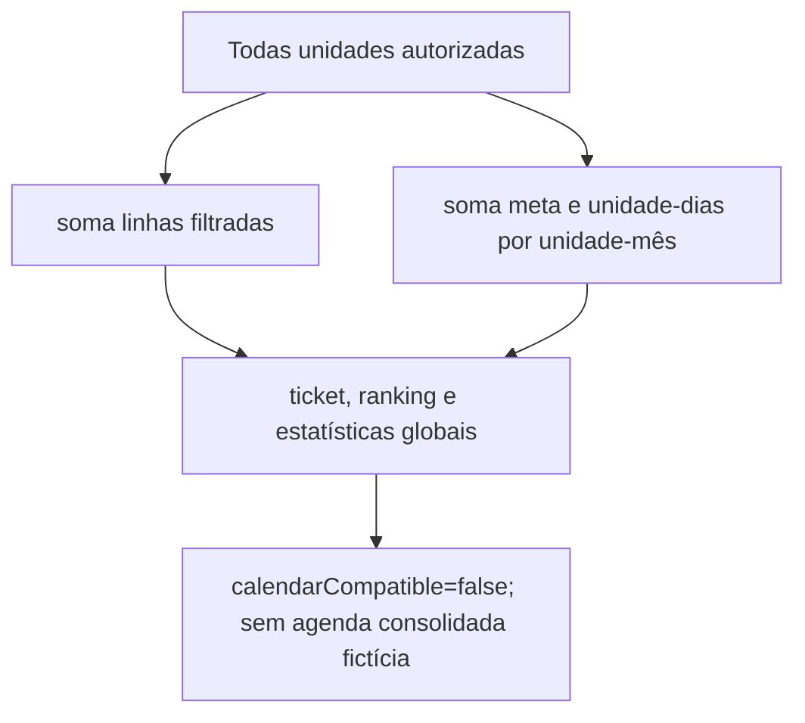

# Runbook — Atendimento local e validação segura

**Escopo:** ambiente local autorizado do operador. Este runbook não autoriza acesso a produção, sincronização, importação com escrita ou exposição de segredos.

## Arquitetura resumida

| Camada | Responsabilidade | Código principal |
| --- | --- | --- |
| Console | Recorte, tabela, formulário, gráficos, cache e estados de UX. | `crm/console/AtendimentoModule.tsx`, componentes `atendimento*` |
| Proxy local | No launcher isolado, Vite encaminha `/api` para a API local. Pages Functions só são usadas no caminho Pages. | `crm/console`, `functions/api/atendimento/[[path]].ts` |
| API | Autenticação de módulo, `allowedUnits`, validação, cálculo financeiro, concorrência, idempotência e auditoria. | `crm/api/server/atendimento/routes.js`, `store.js`, `domain.js` |
| Dados | Registros, metas, agenda, profissionais canônicos/aliases e eventos auditáveis. | schema `crm_atendimento` em PostgreSQL local |
| Operação local | Migration protegida, alocação de portas, smoke e abertura no navegador Windows. | `scripts/run-local-atendimento.sh`, atalho PowerShell |



O **launcher isolado do Atendimento** é o fluxo para validar a API nova. O atalho genérico `CrmLocal` inicia o shell Pages para `conversa`; ele pode ser útil para o CRM geral, mas não comprova o backend isolado do Atendimento e não deve reutilizar uma API antiga em `:8099`.

## Fluxo de dados

### Criação e cálculo do valor





O navegador pode enviar `value`, mas o servidor não o usa para persistir. Ele somente registra, quando aplicável, que havia um valor de cliente ignorado.

### Autorização, concorrência, conversão e Todas unidades









## Dependências e variáveis locais

Pré-requisitos: Windows PowerShell, WSL Ubuntu, `npm`/Node e dependências de `crm/api` e `crm/console`, PostgreSQL local e navegador Windows. Os logs, PIDs, browser Playwright e artefatos devem ficar em `C:\CodexRuntime\operator\admin\skincos`, nunca no repositório.

O launcher lê, nessa ordem, os arquivos locais privados quando existirem:

1. `backend/config/workspace.local.env`;
2. `crm/api/.env`;
3. `.env` na raiz.

Não versionar esses arquivos. Variáveis que podem ser necessárias, sem valores:

| Variável | Uso |
| --- | --- |
| `DATABASE_URL` | Obrigatória; deve apontar exclusivamente para PostgreSQL local `skincos_crm_local`. |
| `CRM_API_PORT` / `FRONTEND_PORT` | Portas preferidas do backend e Vite. |
| `CRM_HOST` | Host do Vite, normalmente `127.0.0.1`. |
| `CRM_OPEN_BROWSER` | `1` para abrir navegador Windows; `0` para execução silenciosa. |
| `CRM_BUILD_BEFORE_START` | `1` para construir antes de subir. |
| `CRM_SMOKE`, `CRM_EXIT_AFTER_SMOKE`, `CRM_SMOKE_HEADED` | Controle do smoke Playwright local. |
| `DEV_AUTH_EMAIL`, `DEV_AUTH_ROLE`, `DEV_AUTH_ALLOWED_MODULES`, `DEV_AUTH_ALLOWED_UNITS` | Perfil local de teste; nunca identidade/credencial de produção. |
| `CRM_PID_FILE`, `CRM_LOG_FILE`, `CRM_PLAYWRIGHT_BROWSERS_PATH` | Caminhos privados de estado e evidência. |

`NO_AUTH=true` e `CRM_LOCAL_NO_AUTH=true` são ativados pelo launcher apenas na API de loopback; não são configuração de produção.

## Iniciar, parar e identificar portas

### Fluxo oficial isolado do Atendimento

No PowerShell, dentro de `C:\CodexShared\Projetos\skincos`:

```powershell
powershell.exe -ExecutionPolicy Bypass -File .\scripts\run-shared-codex-shortcut.ps1 -Action CrmAtendimento
```

O script carrega o ambiente privado, interrompe somente processos cujo comando pertence ao checkout, escolhe portas, aplica a migration de escrita segura local, inicia `crm/api/server.js`, inicia Vite e abre a URL no navegador Windows por `Start-Process`.

Para build e smoke sem manter processos:

```bash
bash ./scripts/run-local-atendimento.sh --build --smoke --exit-after-smoke --no-browser
```

Para parar ambos os launchers do CRM de forma segura:

```powershell
powershell.exe -ExecutionPolicy Bypass -File .\scripts\run-shared-codex-shortcut.ps1 -Action CrmLocalStop
```

Ou, no WSL, somente a instância isolada:

```bash
bash ./scripts/run-local-atendimento.sh --stop
```

### Portas e conflito

| Fluxo | Preferência | Seleção |
| --- | --- | --- |
| Atendimento Vite | `5173` | Sem porta explícita, tenta até `5223`. |
| Atendimento API | `8100` | Sem porta explícita, tenta até `8150`. |
| Shell CRM Pages genérico | Vite `5173`, Pages `8791` | Seleciona a próxima porta livre no intervalo do launcher e publica manifesto privado. |
| Insumos do shell genérico | `8787` | Só pertence ao fluxo genérico; não é requisito do launcher isolado. |

Se uma porta for passada explicitamente (`--frontend-port` ou `--api-port`) e estiver ocupada, o launcher falha em vez de assumir outro processo. Sem opção explícita, ele escolhe a próxima porta livre e imprime a URL final.

Diagnóstico não destrutivo no WSL:

```bash
lsof -nP -iTCP:5173 -sTCP:LISTEN
lsof -nP -iTCP:8100 -sTCP:LISTEN
ps -fp <PID>
```

Não encerre um PID apenas porque usa uma porta conhecida. Use primeiro `--stop`: o script compara argumentos/processo com o checkout antes de encerrar.

## Confirmar API e migrations locais

Após iniciar, use a porta exibida pelo launcher. Por padrão:

```bash
curl -fsS http://127.0.0.1:8100/api/atendimento/health
curl -fsS http://127.0.0.1:8100/api/auth/me
```

No navegador, a chamada `/api/atendimento/health` deve responder pelo mesmo host do Vite, via proxy para essa API local. O processo da API e a URL de saúde impressa pelo launcher são a prova do alvo; `:8099` não é alvo válido dessa validação.

O launcher aplica automaticamente a migration de escrita segura. Para executar apenas no banco local autorizado:

```bash
DATABASE_URL='[URL LOCAL PRIVADA]' node crm/api/scripts/migrate-atendimento-write-safety.mjs --apply
DATABASE_URL='[URL LOCAL PRIVADA]' node crm/api/scripts/migrate-atendimento-professional-identity.mjs --apply
```

Os executores recusam destino diferente de `skincos_crm_local`, exigem banco gravável local e usam lock/timeout curtos. A migration de escrita mantém valores históricos, marca `value_formula_version` legado, preenche `revision=1` onde ausente e deixa `idempotency_key` legada nula fora do índice único parcial.

Verificações de schema sem imprimir a URL:

```bash
psql "$DATABASE_URL" -c "\\d+ crm_atendimento.attendances"
psql "$DATABASE_URL" -c "SELECT indexname FROM pg_indexes WHERE schemaname='crm_atendimento' AND tablename='attendances';"
psql "$DATABASE_URL" -c "SELECT value_formula_version, count(*) FROM crm_atendimento.attendances GROUP BY 1 ORDER BY 1;"
```

Rollback é não destrutivo e deve ser usado somente para teste local controlado:

```bash
DATABASE_URL='[URL LOCAL PRIVADA]' node crm/api/scripts/migrate-atendimento-write-safety.mjs --rollback
```

Ele remove índices/constraints adicionados e mantém colunas, dados e auditoria; uma reaplicação é possível. Não use rollback para apagar histórico. Veja também [atendimento-write-safety-migration.md](atendimento-write-safety-migration.md).

## Executar testes e interpretar o gate

No WSL, a partir da raiz:

```bash
npm --prefix crm/api test
npm --prefix crm/console run typecheck
npm --prefix crm/console run lint
npm --prefix crm/console test
npm --prefix crm/console run build
npm --prefix crm/console run test:e2e
bash ./scripts/run-local-atendimento.sh --smoke --exit-after-smoke --no-browser
```

Em DrvFS, `typecheck` pode sofrer bloqueio de I/O. Nesse caso copie/sincronize somente o console para um cache Linux autorizado e rode o mesmo comando nele; registre saída conclusiva, não considere timeout como sucesso. O smoke depende da API local recém-iniciada, da migration e do navegador Playwright privado.

O **gate** é verde apenas quando o processo sobe, a URL responde e o smoke conclui sem erro de página/API. Um `OK` do shell genérico valida aquele shell, não substitui `smoke:atendimento:local` para o módulo isolado.

## Checklist de validação funcional

### Autorização por unidade

1. Suba com perfil gestor local e confirme acesso às unidades autorizadas e a visão **Todas unidades**.
2. Pare a instância. Suba com perfil não gestor e `DEV_AUTH_ALLOWED_UNITS` contendo apenas uma unidade autorizada.
3. Confirme listagem/criação na unidade permitida e `403` para outra unidade, incluindo PATCH que tente mover um registro para fora do escopo e DELETE de registro de outra unidade.
4. Suba com escopo explícito vazio e confirme que leitura/escrita falham fechadas, sem vazamento de referências, clientes ou conversão.

Os testes de rota/store cobrem a mesma matriz sem depender de dados reais.

### Idempotência, revisão e valor

1. Crie uma linha válida com uma `Idempotency-Key` aleatória e anote `id` e `revision`.
2. Repita o mesmo POST com a mesma chave e mesmo usuário: deve devolver o registro original, sem segunda linha.
3. Envie um `value` adulterado: o valor salvo deve ser o cálculo do backend e a auditoria deve indicar o valor do cliente ignorado quando houver divergência.
4. Faça PATCH com a revisão atual: a resposta incrementa `revision`.
5. Repita o PATCH com a revisão antiga: deve retornar `409`.
6. Faça DELETE com revisão atual e depois tente novamente/revisão antiga: não pode apagar uma segunda vez.

Não reutilize a mesma `Idempotency-Key` entre cenários de autores diferentes ao verificar o índice; a unicidade é deliberadamente por autor.

### Relatórios e interface

- abra e feche a análise: a chamada de conversão só deve aparecer ao abrir;
- confirme que um GET de conversão não cria agenda, configuração ou auditoria de escrita;
- teste meta ausente, período diário/semanal/mensal e um intervalo entre meses;
- compare Novo Hamburgo, BarraShoppingSul e Todas unidades; na última, valide somas e o aviso de calendário incompatível;
- teste profissional alias, profissional inativo e profissional fora da unidade;
- teste tooltip do médico apenas em barra/foto/nome e tooltip de faixa apenas em sua própria linha/ícone;
- valide estado vazio, erro, foco de teclado e viewport `390 × 844`.

## Restaurar o ambiente local

1. Pare os launchers pelo atalho `CrmLocalStop` ou `--stop`.
2. Não use `git clean`, `reset --hard` ou remoção genérica de PIDs para "consertar" o ambiente: há trabalho não relacionado no checkout.
3. Consulte os logs privados informados pelo launcher; por padrão de atalho, ficam abaixo de `C:\CodexRuntime\operator\admin\skincos\logs`.
4. Se a base de teste precisar voltar a um ponto conhecido, restaure somente o backup local autorizado ou recrie a fixture local; nunca use origem de produção sem autorização específica. Execute migrations novamente depois da restauração.
5. Refaça health, schema e smoke. A migration é idempotente e não recalcula valores históricos.

## Problemas conhecidos e decisões pendentes

| Tema | Situação |
| --- | --- |
| `DATABASE_URL` ausente | O launcher para antes de iniciar API. Configurar somente em overlay privado apontando ao banco local. |
| Porta em uso | Use a próxima porta automática ou identifique o PID; não mate processo alheio. |
| `CrmLocal` abre outra tela | É o shell geral (`conversa`); use `CrmAtendimento` para esta validação. |
| TypeScript no DrvFS | Rode o typecheck em cache Linux autorizado e mantenha a saída do comando. |
| Remuneração | Apenas prévia versionada; não usar como folha sem política empresarial aprovada. |
| Pesos da linha de corte | Implementados e rastreáveis, mas ainda pedem validação de negócio. |
| Profissionais parecidos | O relatório sugere casos; nenhuma mesclagem é automática. |
| Calendários de unidades | Todas unidades soma capacidade/meta, mas não apresenta agenda única. |

Para regras e casos matemáticos, consulte [atendimento-core-rules.md](../architecture/atendimento-core-rules.md). Para decisões de interface, consulte [atendimento-experience.md](../architecture/atendimento-experience.md).
