# Campaign Creative Creator: continuous candidate

This change set builds an inactive candidate from the current `Campaign Creative Creator` export (`TxE9eMS1xfE6kq38`). The source export remains the source of truth; the generated candidate is an implementation artifact and has not been imported, activated, or executed in Orb.

## Route and entry contracts

```mermaid
flowchart LR
  M["Manual safe dry-run smoke"] --> F["Build CCG-00 dry-run fixture"] --> N00["CCG-00 Parse & Normalize"]
  T["Operational Production Request\nexecuteWorkflowTrigger"] --> N00
  N00 --> N10["CCG-10"] --> N20["CCG-20"] --> N30["CCG-30"] --> N40["CCG-40"] --> N50["CCG-50"]
  N50 --> G60{"CCG-60 applicable?"}
  G60 -- skip --> S60["SKIPPED_NOT_REQUIRED"]
  G60 -- required --> N60["CCG-60"]
  S60 --> G70{"CCG-70 applicable?"}
  N60 --> G70
  G70 -- skip --> S70["SKIPPED_NOT_REQUIRED"]
  G70 -- required --> N70["CCG-70"]
  S70 --> N80["CCG-80"]
  N70 --> N80
  N80 --> N90["CCG-90 → CONTENT_PACKAGE"]
  E["Separate CCG-99 Error Handler"] -. configured errorWorkflow .-> T
```



The production route carries the request, context, module outputs, trace,
ledger, asset references/binary, and posting guard as one object. The fixture
catalog is generated separately and has no connections.

## What the builder changes

- Keeps the manual CCG-00 dry-run fixture as a safe smoke entry point.
- Removes the independent CCG-10 through CCG-90 dry-run fixtures and reconnects each module return to the next module validator.
- Adds the operational `executeWorkflowTrigger` entry point.
- Leaves provider execution outside this first continuous route. CCG-80 produces
  the manifest and CCG-90 consumes it directly; the existing CCG-90 dry-run
  package simulation is deterministic and the reviewed provider adapter remains
  a separate boundary.
- Preserves the closed-world policy, provider/cost/job limits, human approval requirement, URI-based artifacts, and publication guards.
- Removes filesystem, Python, subprocess, and in-node `require` usage from the
  operational CCG-10 evidence and CCG-40 checksum paths. PDF extraction without
  supplied text is explicitly deferred rather than guessed.
- Extracts the CCG-99 recovery graph into the inactive `Campaign Creative
  Creator - Error Handler` workflow and configures the main candidate with its
  error workflow id.

The builder is idempotent and does not embed a credential, token, or raw export in the repository.

## Rebuild and validate

Use a private export path for `CCG_SOURCE_FILE` and a private output path for `CCG_OUTPUT_FILE`:

```text
CCG_SOURCE_FILE=<private current export> \
CCG_OUTPUT_FILE=<private candidate output> \
npm run workflow:campaign-creative:continuous:build

npm run workflow:campaign-creative:continuous:validate -- --input <candidate.json> --error-input <error-handler.json> --fixtures-input <fixtures.json>
npm run workflow:campaign-creative:continuous:test
```

For SKINCOS, run these commands through `scripts/invoke-skincos-wsl.ps1` so the project runtime stays in Ubuntu-24.04.

## Safety and rollback boundary

The candidate always writes `publish_allowed: false` and `publish_requested: false`. It has no publication or ad-activation path. Dry-run produces no paid provider calls, network calls, or storage writes. A live provider adapter remains a separate reviewed integration boundary and must provide receipts, cost, URI, MIME type, dimensions, checksum, and all lineage fields before results are accepted.

The prior live export/version is retained separately as version `941bec10-3e41-49be-baed-753ca60787ad`. This branch does not modify the n8n database or activate either version. Any import or activation requires a separate operational change with pre-production validation and a reversible version checkpoint.
