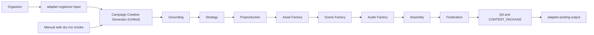

# Target architecture

The stages are inline Code nodes in one n8n workflow; there are no Execute Workflow dependencies. The manual entry creates only a fixed fixture with `dry_run=true`, mock provider policy, zero cost and `publish_requested=false`. Large assets stay in storage and move through the graph as URI, ID, checksum and metadata. The final adapter is a contract boundary only; it has no publication capability.
