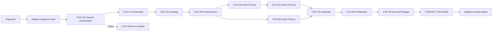

# Target architecture

```mermaid
flowchart LR
  O["Organizer"] --> A["adapter-organizer-input"]
  A --> C00["CCG-00 Content Orchestrator"]
  C00 --> G["CCG-10 Grounding"]
  G --> S["CCG-20 Strategy"]
  S --> P["CCG-30 Preproduction"]
  P --> AF["CCG-40 Asset Factory"]
  AF --> SF["CCG-50 Scene Factory"]
  P --> AU["CCG-60 Audio Factory"]
  SF --> AS["CCG-70 Assembly"]
  AU --> AS
  AS --> F["CCG-80 Finalization"]
  F --> QA["CCG-90 QA and Package"]
  QA --> CP["CONTENT_PACKAGE"]
  C00 -. errors .-> E["CCG-99 Error Handler"]
  CP --> PO["adapter-posting-output"]
```

Large assets stay in storage and move through the graph as URI, ID, checksum and metadata. The final adapter is a contract boundary only; it has no publication capability.
